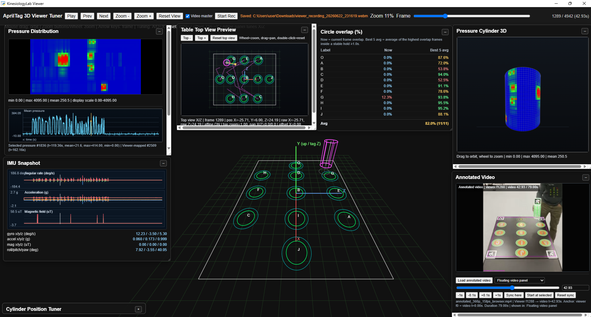
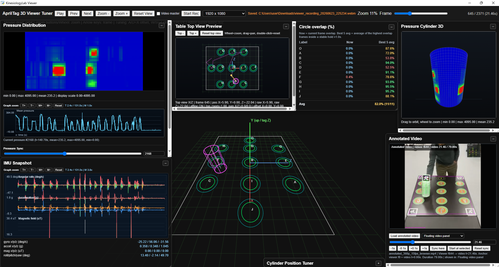

# Hand Grip Force and Trajectory Measurement System

## Overview

This project focuses on the development of a portable, intelligent device designed to measure **hand grip force** and **object trajectory** for neurological assessment, particularly in patients with **stroke** or **Multiple Sclerosis (MS)**.

## Key Features

- 🧠 **Neurological Focus**  
  Designed to evaluate motor function, coordination, and rehabilitation progress in stroke and MS patients.

- 🔧 **Core Technologies**
  - **STM32 Microcontrollers** – Real-time data acquisition and processing
  - **Pressure Sensors** – High-resolution spatial grip force measurement
  - **Gyroscope & IMU Sensors** – Motion and orientation tracking of held objects
  - **Bluetooth** – Wireless data transmission to PC/mobile apps
  - **RTOS** – Deterministic multitasking on embedded systems
  - **Embedded Linux** – Advanced data handling and UI support

## System Architecture

[ Pressure Sensor ] [ Gyroscope / IMU ]
| |
[ Analog Front End ] |
| |
[ STM32 MCU ] <--> [ Bluetooth Module ]
|
[ Data Logger / Wi-Fi ]
|
[ Embedded Linux Platform ]


## Use Case

The system enables clinicians and researchers to:
- Quantitatively assess hand grip strength and control
- Track and visualize object movement during gripping tasks
- Analyze neuromuscular impairments and rehabilitation outcomes

## Future Work

- 🔬 Integration with AI models for predictive analysis  
- 📱 Mobile app for real-time data visualization  
- 🌐 Cloud-based data synchronization and reporting

---

**Developed using:**  
`C/C++ (STM32 HAL)`, `FreeRTOS`, `Python`, `Embedded Linux`, `Bluetooth Low Energy (BLE)`

---

> 📍 *This project is part of ongoing research in neuromuscular assessment and assistive rehabilitation technology.*


## � Developer Docs and Quick Start

- Protocol and wiring details (pins, SPI/UDP framing): `docs/System_Protocol_and_Wiring.md`
- Hardware overview and BOM highlights: `hardware/README.md`

Visualizer quick start (Windows cmd):

1) Install Python packages
  - Open a terminal and run:
    - `python -m pip install -r software\requirements.txt`
2) Set your listen IP/port in `software\viz_config.json` if needed (defaults to 0.0.0.0:12345)
3) Run the visualizer
  - `python software\run_visualizer.py`

Make sure the ESP32 sketch `firmware/esp32/ESP32_C3_Zero_SPI_2048_UDP.ino` has `udpAddress` set to your PC’s IP.


## �🔧 New Design

This section features the redesigned pressure sensor and control PCB with updated layout and schematic.

| Front View | Back View |
|------------|------------|
|  |  |
|  |  |

### 🧩 Schematic


### 3D View of the Pressure Sensor Pad


## 📂 Previous Design

This section showcases the earlier versions of the PCB and sensor module designs for the Hand Grip Force Measurement Device.

| 3D View | 3D View (with Bluetooth Module) |
|--------|-------------------------------|
|  |  |

| PCB Layout | PCB Layout (with Bluetooth Module) |
|------------|------------------------------------|
|  |  |


### 🧪 Assembly and Testing Photos

These images capture key stages of the prototype development, including hardware assembly, sensor components, and testing setup.

| Internal Circuit | Grip Force Testing | PCB in Action |
|------------------|--------------------|---------------|
|  |  |  |

These photos show physical testing and assembly steps:
- Internal circuit mounted inside a cylindrical 3D-printed case.
- Testing hand grip force with the pressure sensor system connected to a display.
- Powered PCB with Bluetooth module running in real hardware.

| Pressure Sensor Pad | Pressure Sensing Demo |
|---------------------|------------------------|
|  |  |

## Application View

Below is a sample visualization of the grip force device showing the **32×64 pressure map** along with gyroscope, accelerometer, and magnetometer data:


## 🎥 Demonstration Video

[](https://www.youtube.com/watch?v=EXzzfofSnuo)

**Real-Time AprilTag Cylinder Tracking with 2D/3D Overlap Visualization**

Click the image above to watch the demonstration video on YouTube.

## 📄 Video Description

This video demonstrates a **real-time vision-based tracking system** using **AprilTags** to estimate and visualize the position of a cylindrical object.  
The system overlays **2D and 3D representations** to show precise alignment and movement tracking, supporting validation of object trajectory and spatial accuracy for experimental and rehabilitation-focused applications.

---

## 🎬 Recent Updates & New Demonstration

### New GripForce 3D Viewer Demo

[](https://www.youtube.com/watch?v=9zOydEpcdT4)

**Watch the new 3D Viewer software demonstration:**  
[GripForce 3D Viewer Software Outlook – YouTube](https://www.youtube.com/watch?v=9zOydEpcdT4)

This video showcases the updated **3D visualization interface** with improved **pressure heatmap display**, **real-time IMU data plots**, and **orientation cylinder rendering**.

### Updated 3D Simulator Visual

A new high-resolution screenshot showing the **GripForce 3D Simulator interface** is now available:



**Recent updates:** Improve viewer sync, graph zoom, and persistent panel layout



This demonstrates the enhanced UI with:
- Realistic 3D pressure blob movement
- Real-time gyroscope, accelerometer, and magnetometer traces
- 3D orientation object (cylinder) rendering
- Adjustable FPS and parameter controls

---

## 🖥️ Application Components

### Pressure Distribution Visualization

- **32×64 heatmap** showing live grip force across the entire sensor pad
- **Adaptive color scaling** with configurable min/max pressure (default: 0–4095)
- **Transformation options**: flip, rotate, or half-mirror for sensor orientation
- **Real-time animation** at ~60 fps (configurable)
- **Non-stretching display**: maintains aspect ratio during window resize

### IMU Data Visualization

- **3 simultaneous data streams**:
  - **Gyroscope**: angular velocity (°/s) at ±250 dps
  - **Accelerometer**: linear acceleration (g) at ±2 g
  - **Magnetometer**: magnetic field (µT)
- **Dual plot modes**:
  - **Per-component**: separate traces for X, Y, Z channels
  - **Magnitude-only**: single trace per sensor type
- **Sliding window buffer**: default 800 samples, configurable
- **Real-time animated plots** with live data injection

### 3D Object Orientation

- **Interactive 3D cylinder** representing held object
- **Quaternion-to-rotation-matrix** conversion from IMU orientation
- **Real-time 3D rendering** alongside 2D plots
- **Optional mode**: can be toggled on/off in visualizer

### Simulator (No Hardware Needed)

- **Realistic pressure patterns**: moving circular blobs with velocity
- **Simulated IMU oscillations**: smooth gyro, accel, mag data
- **UDP broadcast**: sends packets identical to real hardware
- **Interactive mode**: optional GUI for parameter control (`simulator_gui.py`)
- **Perfect for testing** without connected hardware

---

## 🌐 Web Viewer & Pose Acquisition

### Standalone Desktop Viewer

A **pywebview-based desktop application** for viewing 4K video annotated with AprilTag pose data:

```bash
# Launch from command line:
python run_viewer_standalone.bat

# Or manually:
python app/device_pose_acquisition/auto_target_detections/viewer_7371/standalone_viewer.py
```

**Features**:
- Frame-by-frame playback of annotated video
- Overlay circles and pose estimation data
- Synchronized pressure and IMU timeline (if available)
- Portable: single HTML file with embedded data

### AprilTag Pose Detection & Video Annotation

Process 4K video to detect **cylinder position and orientation** using AprilTags:

```bash
python app/device_pose_acquisition/auto_target_detections/detect_apriltag_pose_fixed11_4k.py \
  --video input.mp4 \
  --annotated-out output.mp4 \
  --export-viewer-data viewer_folder \
  --process-fps 15
```

**Output**:
- **Annotated MP4**: overlays detected circles and pose estimates
- **Viewer Data JSON**: frame-by-frame detection results
- **Viewer HTML**: self-contained, portable viewer with embedded data

**Optional Processing**:
- `--start-frame N, --end-frame N`: process specific frame range
- `--undistort`: apply camera calibration correction
- `--max-frames 0`: process all frames (default)

### Video Resizing for Web Playback

Optimize annotated videos for browser streaming:

```bash
# 720p
ffmpeg -vf "scale=1280:-2" -c:v libx264 -crf 23 input.mp4 output_720p.mp4

# 360p, 15 fps
ffmpeg -vf "fps=15,scale=-2:360" -c:v libx264 -crf 27 input.mp4 output_360p_15fps.mp4

# 240p, 15 fps
ffmpeg -vf "fps=15,scale=-2:240" -c:v libx264 -crf 28 input.mp4 output_240p_15fps.mp4
```

---

## 📁 App Folder Contents & File Guide

### `app/` Directory Structure

```
app/
├── app_view.png                           # Screenshot of pressure + IMU visualizer
├── new_gripforce_3dsimulator_outlook.png  # New 3D simulator interface screenshot
├── 3dsimulator_view.png                   # 3D simulator demo view
├── README.md                              # App-specific documentation
│
├── device_data_acquisitiom/               # Real-time data acquisition & visualization
│   ├── simulator.py                       # Simulates realistic pressure/IMU data (no hardware)
│   ├── simulator_gui.py                   # Interactive GUI for simulator
│   ├── viz_full_with_gyro_accel_mag.py    # Standard 2D visualizer
│   ├── viz_full_with_gyro_accel_mag_3Dobj.py  # 2D visualizer + 3D cylinder
│   ├── run_viz_app.bat                    # Launcher for standard visualizer
│   ├── run_viz_3D.bat                     # Launcher for 3D visualizer
│   └── README.txt                         # Device acquisition documentation
│
└── device_pose_acquisition/               # Video processing & web viewer
    ├── 4k_video_process/
    │   ├── extract_frames.py              # Extract frames from video
    │   ├── manual_reference_circle_alphabet_labeler_4k_best_images.py  # Reference marker UI
    │   ├── sessions/                      # NDJSON pressure/IMU replay data
    │   │   ├── session1.ndjson
    │   │   ├── session_2.ndjson
    │   │   └── ...
    │   └── accuracy_analyzer/
    │       ├── Note.txt                   # Command examples for video processing
    │       └── detect_apriltag_pose_*.py  # Various AprilTag detection scripts
    │
    └── auto_target_detections/
        ├── detect_apriltag_pose_fixed11_4k.py  # Main AprilTag detector (exports viewer data)
        ├── extract_frames.py              # Frame extraction utility
        └── viewer_7371/                   # Web viewer assets
            ├── viewer.html                # Portable viewer template
            ├── viewer_data.json           # Exported frame data
            ├── standalone_viewer.py       # Desktop launcher
            └── session.ndjson, session_2.ndjson  # Example session files
```

### How to Use Each File

| File | Usage |
|------|-------|
| **simulator.py** | Start with `python simulator.py --ip 127.0.0.1 --port 12345 --fps 60` to test visualizer without hardware |
| **viz_full_with_gyro_accel_mag.py** | Main visualizer; shows pressure + IMU data |
| **viz_full_with_gyro_accel_mag_3Dobj.py** | Enhanced visualizer with 3D object rendering |
| **detect_apriltag_pose_fixed11_4k.py** | Process 4K video to export annotated frames and viewer data |
| **viewer.html** | Open in browser or desktop app to view posed video frames |
| **session*.ndjson** | Replay recorded pressure/IMU data; import into analysis tools |

---

## 📊 Data Formats

### Pressure Data

- **32 rows × 64 columns** (2048 total samples per frame)
- **UDP packets**: 10 packets per frame, 205 uint16 values per packet
- **Data type**: uint16, little-endian
- **Range**: 0–4095 (raw 12-bit ADC)
- **Default endpoint**: UDP `0.0.0.0:12345`
- See `docs/System_Protocol_and_Wiring.md` for detailed packet structure

### IMU Data

- **Gyroscope**: ±250 dps (131.0 LSB/deg/s)
- **Accelerometer**: ±2 g (16384.0 LSB/g)
- **Magnetometer**: ±120 µT (0.15 µT/LSB, AK09916 sensor)
- **Update rate**: ~60 fps (synchronized with pressure frames)
- **Format**: big-endian int16 values with header: `b'\xAA\x55IM'`

### Viewer Data (JSON Export)

- **Self-contained HTML** with embedded frame data
- **Per-frame annotations**: circle overlays, pose estimates, detection results
- **Portable format**: open in any browser or desktop viewer
- Generated by `detect_apriltag_pose_fixed11_4k.py --export-viewer-data <path>`

### Session Data (NDJSON)

- **Streaming-safe newline-delimited JSON**
- **One JSON object per line** (metadata + frames)
- **Contains**: frame_idx, timestamp, flattened pressure array, IMU components
- **Schema**: `kinesiology.pressure_imu.ndjson.v1`
- **Use case**: replay in web viewer, time-series analysis

---

## 🎯 Quick Start Guide

### 1. **Test Without Hardware** (Simulator)

```bash
# Terminal 1: Run simulator
cd app/device_data_acquisitiom
python simulator.py --ip 127.0.0.1 --port 12345 --fps 60

# Terminal 2: Run visualizer
python viz_full_with_gyro_accel_mag.py --ip 0.0.0.0 --port 12345 --show-magnitude
```

Or use batch files:
```bash
run_viz_app.bat      # Standard visualizer
run_viz_3D.bat       # 3D visualizer
```

### 2. **Process 4K Video & Export Viewer Data**

```bash
cd app/device_pose_acquisition/auto_target_detections
python detect_apriltag_pose_fixed11_4k.py \
  --video path/to/video.mp4 \
  --annotated-out output.mp4 \
  --export-viewer-data viewer_output
```

Then open `viewer_output/viewer.html` in a browser or desktop viewer.

### 3. **With Real Hardware**

1. Program **ESP32** with `firmware/esp32/ESP32_C3_Zero_SPI_2048_UDP.ino` (set your PC IP)
2. Program **STM32F103C8T6** with firmware in `firmware/stm32f103c8t6/`
3. Connect pressure sensor pad to multiplexer chain (see pinouts in `docs/System_Protocol_and_Wiring.md`)
4. Run visualizer:
   ```bash
   python viz_full_with_gyro_accel_mag.py --ip 0.0.0.0 --port 12345 --show-magnitude
   ```

---

## 📖 Full Project Documentation

For comprehensive technical details, see:

- **[INSTRUCTIONS.md](INSTRUCTIONS.md)** — Project rules, data formats, development guidelines
- **[docs/System_Protocol_and_Wiring.md](docs/System_Protocol_and_Wiring.md)** — Pinouts, SPI/UDP packet structure, timing specs
- **[hardware/README.md](hardware/README.md)** — KiCad project, BOM, component references
- **[app/README.md](app/README.md)** — Visualizer usage, simulator commands, viewer workflow

---

## ❓ Frequently Asked Questions

**Q: Can I use the system without hardware?**  
A: Yes! Run the simulator (`simulator.py`) to generate realistic pressure and IMU data.

**Q: What video formats are supported?**  
A: MP4, MOV, AVI (via OpenCV). 4K video (3840×2160) is recommended for AprilTag detection.

**Q: How do I export data for statistical analysis?**  
A: Use NDJSON session files (see Session Data format) or export viewer JSON. Both are Python/R compatible.

**Q: Can I visualize multiple sessions simultaneously?**  
A: Not in the current version. Planned for future releases.

**Q: Is there a mobile app?**  
A: Mobile support is planned for future versions. Currently PC-only (Windows/Linux/Mac).

---

## 📝 Notes from Previous Work

*Summarized from `app/device_pose_acquisition/4k_video_process/accuracy_analyzer/Note.txt`:*

### AprilTag Processing: Script Variants & Frame Range Control

The project includes **three AprilTag detection script variants**. Choose based on your needs:

#### Script Variants

| Script | Use Case | Key Features |
|--------|----------|--------------|
| **detect_apriltag_pose_fixed11_4k.py** | Main production script | Full video processing, camera matrix auto-scaling |
| **detect_apriltag_pose_fixed11_4k_option3_single_state.py** | Simplified variant | Fewer options, single tracking mode |
| **detect_apriltag_pose_fixed11_4k_option3_single_state_start_end_frame.py** | **Best for testing/partial processing** | Frame range control (`--start-frame`, `--end-frame`) |

#### Key Parameters Explained

- **`--start-frame N`** — Begin processing at frame N (1-based). Default: 1
- **`--end-frame N`** — Stop processing at frame N, inclusive. Default: 0 (process until video ends)
- **`--process-fps F`** — Limit processing to F fps (e.g., 15). Skips frames to reduce computation. Default: 0 (no limit)
- **`--max-frames N`** — Process only N frames starting from `--start-frame`. Default: 0 (no limit)
- **`--annotated-out FILE`** — Write video with overlays drawn (AprilTag pose, cylinder, axes)
- **`--export-viewer-data PATH`** — Generate interactive 3D viewer HTML + JSON data to PATH folder or .json file

#### Usage Examples

**Example 1: Quick test (first 150 frames, 5 fps)**
```powershell
python detect_apriltag_pose_fixed11_4k.py `
  --video input.mov `
  --annotated-out output.mp4 `
  --max-frames 150 `
  --process-fps 5
```

**Example 2: Full video with viewer export**
```powershell
python detect_apriltag_pose_fixed11_4k.py `
  --video input.mov `
  --annotated-out output.mp4 `
  --export-viewer-data ./viewer_output `
  --process-fps 15
```

**Example 3: Frame range (test specific section, e.g., 19 June capture)**
```powershell
python detect_apriltag_pose_fixed11_4k_option3_single_state_start_end_frame.py `
  --video IMG_006_19June.mov `
  --annotated-out annotated_IMG_006_19June.mp4 `
  --export-viewer-data ./viewer_006_19June `
  --process-fps 15 `
  --start-frame 300 `
  --end-frame 900
```

#### Output Files Created

Each command generates:

- **`annotated_*.mp4`** — Video file with AprilTag overlays (boxes, axes, cylinder object)
- **`viewer_output/`** (if using `--export-viewer-data`):
  - `viewer.html` — Self-contained interactive 3D viewer (open in browser)
  - `viewer_data.json` — Extracted frame data (frame index, detected tags, poses, circle overlaps)
  - Optional: `viewer_data_overlay.json`, pose history CSV

#### Processing Tips

- **For testing**: Use `--start-frame` and `--end-frame` to process only the section you care about
- **For speed**: Reduce `--process-fps` (e.g., 5 fps processes 5 frames per second of video)
- **For accuracy**: Keep `--process-fps` high (15+) or omit it for full precision
- **For web playback**: Use FFmpeg to resize annotated videos (see next section)

### Video Format Optimization

The Note.txt includes FFmpeg commands for resizing annotated videos for web playback (720p, 360p, 240p variants).

---

## ❓ Needs Confirmation

The following items need clarification or user confirmation:

1. **New Demonstration Video Purpose**
   - URL: `https://www.youtube.com/watch?v=0S4J9DHq-p0`
   - Context: Is this a 3D viewer demo, new features showcase, or user workflow guide?

2. **Web Viewer Path Consistency**
   - Previous docs reference `web_viz_app/` but current code uses `device_pose_acquisition/auto_target_detections/viewer_7371/`
   - Should legacy paths be updated or maintained for backward compatibility?

3. **Session Data Archiving**
   - How should users manage large NDJSON files (>1 GB)?
   - Is cloud storage integration planned?

4. **Pressure Calibration**
   - Are there reference calibration procedures or known sensor limitations?
   - Should calibration UI be prioritized for next release?

5. **Multi-platform Support**
   - Current `.bat` files are Windows-only. Are Linux/macOS batch files needed?
   - Should the project add `.sh` shell scripts?

---

## Contributing & Support

For bug reports, feature requests, or contributions, please refer to the **[INSTRUCTIONS.md](INSTRUCTIONS.md)** for project rules and development guidelines.

---

> **Last Updated**: June 22, 2026  
> **Maintained by**: KinesiologyLab Team  
> **License**: [Specify as needed]
