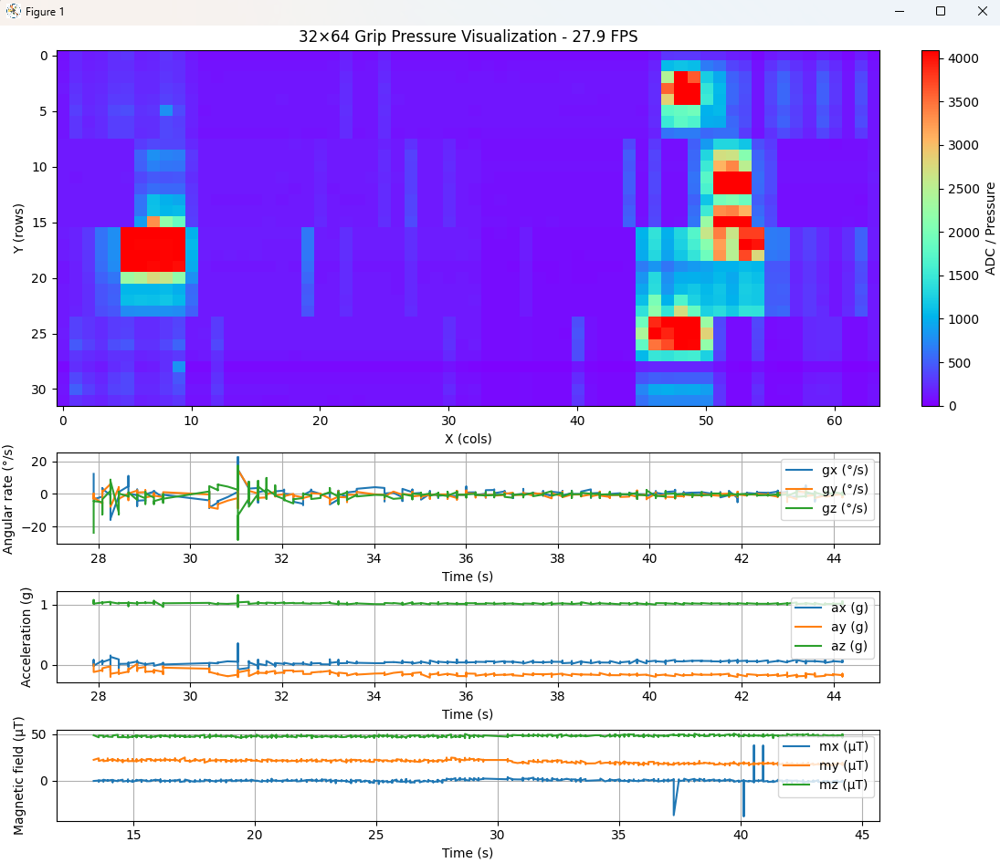

# Hand Grip Force and Trajectory Measurement System

## Overview

This project focuses on the development of a portable, intelligent device designed to measure **hand grip force** and **object trajectory** for neurological assessment, particularly in patients with **stroke** or **Multiple Sclerosis (MS)**.

## Key Features

- 🧠 **Neurological Focus**  
  Designed to evaluate motor function, coordination, and rehabilitation progress in stroke and MS patients.

- 🔧 **Core Technologies**
  - **STM32 Microcontrollers** – Real-time data acquisition and processing
  - **Pressure Sensors** – High-resolution spatial grip force measurement
  - **Gyroscope & IMU Sensors** – Motion and orientation tracking of held objects
  - **Bluetooth** – Wireless data transmission to PC/mobile apps
  - **RTOS** – Deterministic multitasking on embedded systems
  - **Embedded Linux** – Advanced data handling and UI support

## System Architecture

[ Pressure Sensor ] [ Gyroscope / IMU ]
| |
[ Analog Front End ] |
| |
[ STM32 MCU ] <--> [ Bluetooth Module ]
|
[ Data Logger / Wi-Fi ]
|
[ Embedded Linux Platform ]

## Use Case

The system enables clinicians and researchers to:
- Quantitatively assess hand grip strength and control
- Track and visualize object movement during gripping tasks
- Analyze neuromuscular impairments and rehabilitation outcomes

## Future Work

- 🔬 Integration with AI models for predictive analysis  
- 📱 Mobile app for real-time data visualization  
- 🌐 Cloud-based data synchronization and reporting

---

**Developed using:**  
`C/C++ (STM32 HAL)`, `FreeRTOS`, `Python`, `Embedded Linux`, `Bluetooth Low Energy (BLE)`

---

> 📍 *This project is part of ongoing research in neuromuscular assessment and assistive rehabilitation technology.*

## � Developer Docs and Quick Start

- Protocol and wiring details (pins, SPI/UDP framing): `docs/System_Protocol_and_Wiring.md`
- Hardware overview and BOM highlights: `hardware/README.md`

Visualizer quick start (Windows cmd):

1) Install Python packages
  - Open a terminal and run:
    - `python -m pip install -r software\requirements.txt`
2) Set your listen IP/port in `software\viz_config.json` if needed (defaults to 0.0.0.0:12345)
3) Run the visualizer
  - `python software\run_visualizer.py`

Make sure the ESP32 sketch `firmware/esp32/ESP32_C3_Zero_SPI_2048_UDP.ino` has `udpAddress` set to your PC’s IP.

## �🔧 New Design

This section features the redesigned pressure sensor and control PCB with updated layout and schematic.

| Front View | Back View |
|------------|------------|
|  |  |

### 🧩 Schematic

### 3D View of the Pressure Sensor Pad

## 📂 Previous Design

This section showcases the earlier versions of the PCB and sensor module designs for the Hand Grip Force Measurement Device.

| 3D View | 3D View (with Bluetooth Module) |
|--------|-------------------------------|
|  |  |

| PCB Layout | PCB Layout (with Bluetooth Module) |
|------------|------------------------------------|
|  |  |

### 🧪 Assembly and Testing Photos

These images capture key stages of the prototype development, including hardware assembly, sensor components, and testing setup.

| Internal Circuit | Grip Force Testing | PCB in Action |
|------------------|--------------------|---------------|
|  |  |  |

These photos show physical testing and assembly steps:
- Internal circuit mounted inside a cylindrical 3D-printed case.
- Testing hand grip force with the pressure sensor system connected to a display.
- Powered PCB with Bluetooth module running in real hardware.

| Pressure Sensor Pad | Pressure Sensing Demo |
|---------------------|------------------------|
|  |  |

## Application View

Below is a sample visualization of the grip force device showing the **32×64 pressure map** along with gyroscope, accelerometer, and magnetometer data:

