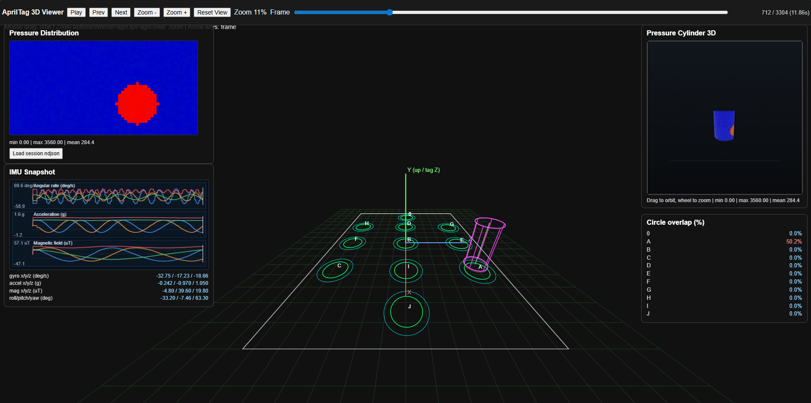

# KinesiologyLab Grip Pressure + IMU Visualization System

## Project Description

This project provides a real-time visualization system for a 32×64 grip pressure sensor array combined with IMU (gyroscope, accelerometer, magnetometer) data. It is designed for research or clinical applications in kinesiology, biomechanics, or hand function studies. The system can visualize live data from real hardware or from a built-in simulator that generates realistic sensor data.

### Features
- Real-time heatmap visualization of grip pressure (32×64 grid)
- Real-time plots of gyroscope, accelerometer, and magnetometer data
- 3D orientation visualization (with the 3D visualizer)
- Optional CSV logging
- Simulator for development/testing without hardware

### Screenshots

3D simulator view:



App view:


---

## How to Use

### 1. Run the Simulator (No Hardware Needed)
Open a terminal in the `app` folder and run:

```
python simulator.py --ip 127.0.0.1 --port 12345 --fps 60
```
- `--ip` and `--port` must match the visualizer settings (default is 127.0.0.1:12345)
- `--fps` sets the update rate (frames per second)

### 2. Run the Visualization Software
Open a second terminal in the same folder. You can use either the batch files or run the Python scripts directly.

#### Standard Visualizer
```
python viz_full_with_gyro_accel_mag.py --ip 0.0.0.0 --port 12345 --show-magnitude
```
Or simply double-click/run:
```
run_viz_app.bat
```

#### 3D Visualizer
```
python viz_full_with_gyro_accel_mag_3Dobj.py --ip 0.0.0.0 --port 12345 --show-magnitude --show-3d
```
Or simply double-click/run:
```
run_viz_3D.bat
```

### 3. See Live Simulated Data
The visualizer will display animated, realistic grip and IMU data as if real hardware is connected.

### 4. Run the Web Viewer as a Standalone Desktop App
You can open `web_viz_app/viewer_7371/viewer.html` in its own desktop window (no browser tab):

```
run_viewer_standalone.bat
```

Or run directly:

```
python web_viz_app/viewer_7371/standalone_viewer.py
```

If needed, install the dependency once:

```
python -m pip install pywebview
```

### 5. AprilTag Export Viewer Workflow (Updated)
`web_viz_app/detect_apriltag_pose_fixed11_4k.py` supports exporting viewer artifacts with:

```
python web_viz_app/detect_apriltag_pose_fixed11_4k.py --export-viewer-data web_viz_app/viewer_7371
```

Export behavior:
- Writes `viewer_data.json` (sanitized numeric export data)
- Writes `viewer.html` (portable viewer with embedded data)
- Reuses the maintained viewer template from `web_viz_app/viewer_7371/viewer.html` (fallback: `viewer2.html`) and injects fresh exported data into it

Why `viewer.html` is still written:
- Keeps a single self-contained artifact that can be opened directly (including standalone desktop mode)
- Preserves compatibility with existing workflows while still reusing the shared template code

Note:
- The current exporter intentionally updates both files for portability and backward compatibility.

---

## GUI Simulator (Recommended)

`simulator_gui.py` is a full professional virtual hardware testing tool with a dark-themed control panel.

```
python simulator_gui.py --ip 127.0.0.1 --port 12345
```

Or start streaming automatically on launch:
```
python simulator_gui.py --ip 127.0.0.1 --port 12345 --auto-start
```

### GUI Features
- Live sliders for gx/gy/gz, ax/ay/az, mx/my/mz, pressure position/radius/strength, FPS
- AUTO / MANUAL toggle buttons for IMU and pressure
- Reset IMU button
- Start/Pause streaming button
- Live pressure map preview
- IMU readings display and actual FPS counter
- **Motion Presets**: Gripping, Rolling, Shaking, Twisting, Static Hold, Random Motion
- **Record** simulated sessions to CSV
- **Replay** recorded sessions
- Dark theme

---

## Keyboard-Only Simulator (Legacy)

```
python simulator.py --ip 127.0.0.1 --port 12345 --fps 60 --manual-imu --manual-pressure
```

---

## Example Commands (Quick Reference)

```
# Start GUI simulator (recommended)
python simulator_gui.py --ip 127.0.0.1 --port 12345 --auto-start

# Start keyboard simulator (legacy)
python simulator.py --ip 127.0.0.1 --port 12345 --fps 60

# Start standard visualizer
python viz_full_with_gyro_accel_mag.py --ip 0.0.0.0 --port 12345 --show-magnitude

# Start 3D visualizer
python viz_full_with_gyro_accel_mag_3Dobj.py --ip 0.0.0.0 --port 12345 --show-magnitude --show-3d
```

---

## Notes
- The simulator is a drop-in replacement for the real hardware device.
- You can adjust the simulator's FPS or add keyboard/mouse control for more interactive testing.
- Make sure Python and required packages (numpy, matplotlib) are installed.
- The visualizer and simulator must use the same IP and port.
